# All Pro Charter — Lead Manager · Entity-Relationship Diagram

**Prepared:** 2026-06-10 · Lansdowne Data
**Scope:** version 1 — capture + inbox + quoting + **deposits/balance (Stripe)** + LimoAnywhere sync + Podium messaging.
**Companions:** [Solution Design](./../../APC_Lead_Manager_Solution_Design.pdf) · [Integration Matrix](./../../APC_Integration_Matrix_FINAL.pdf) · [Portal design spec](./2026-06-09-lead-manager-portal-design.md)

The hub is **Lead** (= one Quote/Order). A Lead belongs to a **Contact**, holds many **Reservations** (each a future LimoAnywhere reservation), carries one **PaymentPlan** (deposit + balance) with many **Charge** attempts, and accretes **Messages**, **TouchPoints**, **Reviews**, **Notifications**, and **ZapEvents** (the sync log).

```mermaid
erDiagram
    CONTACT      ||--o{ LEAD          : "has quotes"
    USER         ||--o{ LEAD          : "assigned agent"
    LEAD         ||--|{ RESERVATION   : "contains"
    VEHICLE      ||--o{ RESERVATION   : "typed as"
    RESERVATION  ||--|{ STOP          : "routes through"
    RESERVATION  ||--o{ TRIP_STATUS_EVENT : "dispatch history"
    LEAD         ||--|| PAYMENT_PLAN  : "billed by"
    PAYMENT_PLAN ||--o{ CHARGE        : "attempts"
    LEAD         ||--o{ MESSAGE       : "thread"
    LEAD         ||--o{ TOUCHPOINT    : "schedules"
    LEAD         ||--o{ REVIEW        : "review"
    LEAD         ||--o{ NOTIFICATION  : "raises"
    USER         ||--o{ NOTIFICATION  : "receives"
    LEAD         ||--o{ ZAP_EVENT     : "syncs via"
    LEAD         ||--o{ PODIUM_EVENT  : "inbound webhook"
    LEAD         ||--o{ AUDIT_LOG     : "tracked by"
    USER         ||--o{ AUDIT_LOG     : "acts in"

    CONTACT {
        bigint id PK
        string name
        string company
        string phone
        string email
        string channel "website,wedding_pro,phone,api"
        string la_account_id "LimoAnywhere Account"
        string podium_contact_uid "Podium contact UID"
        datetime created_at
    }
    USER {
        bigint id PK
        string name
        string email
        string role "owner_admin,agent"
        bool two_factor_enabled
        datetime last_login
    }
    LEAD {
        bigint id PK
        bigint contact_id FK
        bigint assigned_agent_id FK "nullable"
        string quote_no "Q-####"
        string status "new,quoted,booked,lost"
        string channel "source"
        text notes
        string lost_reason "nullable"
        bool has_alert "open payment/sync issue"
        datetime created_at
        datetime updated_at
    }
    VEHICLE {
        bigint id PK
        string name "Mini Coach (28)"
        int capacity
        string klass "sedan,suv,van,mini_coach,coach,limo"
        bool active
    }
    RESERVATION {
        bigint id PK
        bigint lead_id FK
        bigint vehicle_id FK
        string trip_type "transfer,hourly"
        string service "label"
        date pickup_date
        time pickup_time
        int passengers
        decimal base_rate "transfer flat"
        decimal hours "hourly"
        decimal hourly_rate "hourly"
        decimal min_hours "hourly minimum"
        string la_reservation_id "set on booking"
        string trip_status "LA dispatch status, e.g. Assigned, On The Way, Done"
        string trip_phase "status group, e.g. Driver is Assigned"
        int sort_order
    }
    STOP {
        bigint id PK
        bigint reservation_id FK
        int sequence "0=pickup .. n=dropoff"
        string address
        string note "e.g. 20-min photo stop"
    }
    TRIP_STATUS_EVENT {
        bigint id PK
        bigint reservation_id FK
        string status "LA status label"
        string phase "dispatch group"
        string source "limoanywhere,manual"
        bigint changed_by_id FK "nullable"
        datetime changed_at
    }
    PAYMENT_PLAN {
        bigint id PK
        bigint lead_id FK
        int deposit_pct "default 50"
        decimal quote_total "snapshot"
        decimal deposit_amount
        decimal balance_amount
        string deposit_status "unsent,requested,paid"
        string balance_status "na,scheduled,paid,failed"
        date balance_due_date "30d before earliest pickup"
        string processor "stripe"
        string stripe_customer_id
        string stripe_payment_method_id "card on file"
        string card_brand
        string card_last4
        string fail_reason "nullable"
        datetime created_at
    }
    CHARGE {
        bigint id PK
        bigint payment_plan_id FK
        string kind "deposit,balance"
        decimal amount
        string status "pending,succeeded,failed"
        string stripe_payment_intent_id
        string idempotency_key "no double-charge"
        string failure_reason "nullable"
        int attempt_no
        datetime attempted_at
    }
    MESSAGE {
        bigint id PK
        bigint lead_id FK
        string direction "in,out"
        string channel "sms,email,facebook,whatsapp,apple"
        text body
        string podium_conversation_uid
        string podium_message_uid
        string delivery_status "sent,received,failed"
        string failure_reason "e.g. landline"
        datetime sent_at
    }
    TOUCHPOINT {
        bigint id PK
        bigint lead_id FK
        string kind "greeting,quote_followup,pretrip_reminder,review_request"
        string status "scheduled,sent,skipped"
        datetime scheduled_for
        datetime sent_at "nullable"
        string podium_message_id "nullable"
    }
    REVIEW {
        bigint id PK
        bigint lead_id FK
        bigint contact_id FK
        string podium_review_invite_uid
        string delivery_status "pending,sent,delivered,failed"
        bool link_clicked
        int rating "1-5, from attribution"
        text body "from attribution"
        string review_site "attributed site"
        datetime requested_at
    }
    NOTIFICATION {
        bigint id PK
        bigint lead_id FK
        bigint user_id FK "nullable target"
        string kind "balance_failed,balance_paid,deposit_paid,sync_failed,new_lead"
        string title
        string detail
        bool read
        datetime created_at
    }
    ZAP_EVENT {
        bigint id PK
        bigint lead_id FK
        string action "create_account,quote_request,create_reservation,status_writeback"
        json payload
        string result "pending,success,error"
        string idempotency_key
        text response
        datetime created_at
    }
    PODIUM_EVENT {
        bigint id PK
        bigint lead_id FK "nullable"
        string event_type "message.received,message.sent,message.failed"
        json payload
        bool processed
        datetime created_at
    }
    AUDIT_LOG {
        bigint id PK
        bigint user_id FK
        bigint lead_id FK "nullable"
        string action
        json changes
        datetime created_at
    }
```

## Entity reference

| Entity | Purpose | Key relationships |
|---|---|---|
| **Contact** | The customer (person/company); the LimoAnywhere **Account**. | 1 → many **Lead** |
| **Lead** *(= Quote/Order)* | The hub. One quote with a pipeline status. | → Contact, Agent; 1 → many Reservation; 1 → 1 PaymentPlan |
| **Reservation** | A priced trip line item; becomes one LA reservation on booking. Carries its own **operational `trip_status`** (separate from the lead's sales status). | → Lead, Vehicle; 1 → many Stop, TripStatusEvent |
| **Stop** | Ordered route node. `sequence 0` = pickup, last = drop-off, middle = stops (**multi-stop**). | → Reservation |
| **TripStatusEvent** | Dispatch-status history per reservation (each change, with source LA-or-manual + timestamp). | → Reservation, optional User |
| **Vehicle** | Reference list of vehicle types + capacity. | 1 → many Reservation |
| **PaymentPlan** | The deposit + balance plan for a quote; holds Stripe customer + card on file. | 1 ↔ 1 Lead; 1 → many Charge |
| **Charge** | A single Stripe attempt (deposit or balance), with idempotency + failure reason. | → PaymentPlan |
| **Message** | Inbound/outbound Podium thread item — multi-channel (sms/email/facebook/whatsapp/apple) with Podium UIDs + delivery state; **inbound arrives via webhook**. | → Lead |
| **TouchPoint** | Scheduled automated message (greeting, follow-up, reminder, review request) via Podium. | → Lead |
| **Review** | Podium review **invite** — delivery status, link-click, and the attributed rating/body/site. | → Lead, Contact |
| **Notification** | In-app alert (drives the bell); created on **balance_failed**, deposit_paid, sync_failed, etc. | → Lead, optional User |
| **ZapEvent** | Sync log — every Zapier/LimoAnywhere push, payload + result, idempotency key, for traceability + retries. | → Lead |
| **PodiumEvent** | Inbound Podium webhook log (`message.received/sent/failed`) — payload + processed flag. | → Lead (nullable) |
| **AuditLog** | Change trail for security/compliance. | → User, Lead |

## Design notes

- **Computed, not stored:** `Reservation.line_total` = `base_rate` (transfer) or `max(hours, min_hours) × hourly_rate` (hourly) + surcharges; `Lead.quote_total` = Σ line totals. `PaymentPlan` snapshots `quote_total` / `deposit_amount` / `balance_amount` at send time so figures don't drift after a quote is issued.
- **`balance_due_date`** = 30 days before the **earliest** `Reservation.pickup_date` on the lead; if that date is already past at booking, the balance is **due immediately**.
- **Idempotency everywhere it touches money or external systems:** `Charge.idempotency_key` (Stripe) and `ZapEvent.idempotency_key` (Zapier/LA) guarantee retries never double-charge or duplicate reservations.
- **No card data on our servers:** only Stripe references (`stripe_customer_id`, `stripe_payment_method_id`) + display `card_brand`/`card_last4`. Keeps PCI scope at **SAQ-A**.
- **Status enums** mirror the prototype exactly: Lead `new→quoted→booked→lost`; deposit `unsent→requested→paid`; balance `na→scheduled→paid→failed`.
- **Podium (verified against docs.podium.com, 2026-06):** OAuth 2.0 authorization-code, **10-hour** access tokens (refresh stored); scopes `read_/write_messages`, `read_/write_contacts`, `read_/write_reviews`. **Inbound messages arrive by webhook** (`message.received` / `sent` / `failed`) — *not* polling. Every Podium object is a string **UID**, mirrored on `Contact` / `Message` / `Review`; inbound webhooks are logged as `PodiumEvent`.
- **Two independent statuses.** The **Lead** carries the *sales* status (`new→quoted→booked→lost`); each **Reservation** carries its own *operational* `trip_status` — a booked quote can have several trips at different dispatch stages, and a trip can go No-show / Cancelled while the lead stays Booked.
- **`trip_status` = the exact LimoAnywhere taxonomy**, grouped by `trip_phase` for display: *Created* (Unassigned · Farm-out Unassigned · Pending) → *Offered to Driver* → *Driver is Assigned* (Assigned · Dispatched - Driver Assigned) → *En Route* (On The Way) → *Circling* → *Waiting at Pickup* (Arrived) → *Driving Passenger* (Customer In Car) → *Completing* (Done); plus *Cancelled* (Cancelled · Cancelled by Affiliate · Late Cancel · No Show · COVID-19 Cancellation), *Offered to Affiliate*, *Affiliate is Assigned*, and *Other* (Dispatched - Driver Assigned NON LA). Sourced from the **LA status-writeback webhook**; editable in-portal for **off-LA affiliate** trips (manual handoff). **Done** fires the post-trip **review request** TouchPoint.
- **Round trips** are two Reservations (e.g., wedding outbound + return), matching the prototype.
